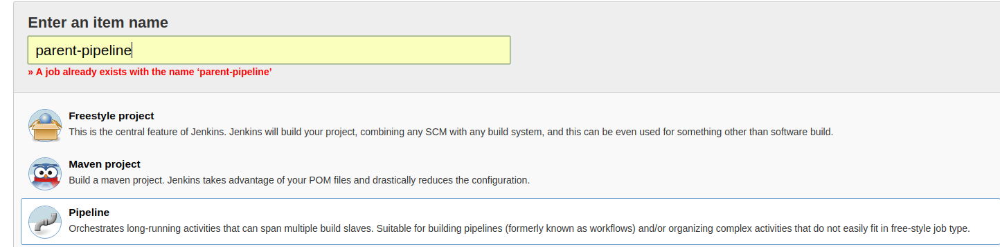

# Sistema de integración continua usando Pipeline Jenkins (v2.60.3)

Manual de configuración para la versión 2.60.3 de Jenkins a fecha de 08/02/2018.

**Nota:** La configuración de Jenkins será la misma que la documentada para la versión v2.60.3 con una excepción que será documentada y explicada a continuación. 

## Modificación de la configuración de Jenkins(v2.60.3) 

### Aumento del número de ejecutores

En la configuración inicial de esta versión de Jenkins se determinó por defecto el número de ejecutores a 2. Para ejecutar esta versión se debe aumentar a 4 coincidiendo con el número de cores del servidor (en caso de disponer de más es posible aumentarlo a dicho número). 

Para realizar esta modificación se debe acceder al menu *Manage Jenkins > Configure System > Maven Project Configuration* y aumentar la cifra de ejecutores a 4 tal como se muestra en la imagen inferior.


## Standard-Maven-Pipelines

Se han definido tres jobs para la automatización del sistema de integración. El primero para agregar Jenkins al sistema 

### Parent pipeline

Este job realizará las fases de maven necesarias para todos los proyectos parent, así como la activación de los plugins deseados en la etapa de Post-Build. Se corresponde con la plantilla localiza en la carpeta Templates con el nombre *parent-pipeline* 

* **Alta del job en Jenkins**

Crear un nuevo item de tipo **Pipeline**. 



Una vez creado el job es necesario configurarlo. Para ello se accede a la pestaña *Configure*, en la pestaña *Pipeline* seleccionar la opción Pipeline script y copiar el contenido de la plantilla *parent-pipeline* de la carpeta Templates. 


- **Environment Variables** 

A continuación se definen y especifican las variables de entorno que deben estar declaradas de forma obligatoria en Jenkins para el funcionamiento de los Pipelines.  En caso de duda acerca del funcionamiento o la forma de configuración de dichar variables consultar la documentación sobre la configuración de Jenkins(v2.60.3)

    - $MAVEN_SCRIPTS_BASE_PATH

- **Parámetros**

    - PROJECT_WORKSPACE: Ruta al workspace del proyecto *upstream* que realizó la llamada al parent pipeline. Debe ser la variable de entorno de Jenkins {env.WORKSPACE}.

- **Stages** 

    - Clean Stage. Fase de limpieza de maven. Elimina el target creado previamente para poder volver a crearlo de cero. 
    - Compile Stage. Fase de compilación de maven. 
    - Package Stage. Fase de empaquetado de maven. Empaqueta el código compilado y lo transformar en algún formato, en este caso al tratarse del proyecto padre, comúnmente será de tipo .jar o .war.
    - Install Stage. Fase de instalación de maven.  Instala el código empaquetado en el repositorio local de Maven, para usarlo como dependencia de otros proyectos. 
    - Deploy Stage. Fase de despliegue de maven. Despliega el código a un entorno (deploy).
    - Activate Chuck Norris Plugin. Activa el plugin utilizado en la fase de *Post-build* de Jenkins. Requiere tener instalado dicho plugin. Puede ser eliminada en caso de no querer incluirlo. 

- **Funcionamiento**

Cada uno de los stages realiza la llamada a un script bash en el cuál se ejecuta cada fase de maven partiendo de una imagen docker. A todos los scripts se le pasa un parámetro, el contexto de ejecución de dicha fase (parámetro PROJECT_WORKSPACE del pipeline). 

- **Modificación o Amplicación del Pipeline** 

Las fases incluidas en el Pipeline son las usadas más comúnmente pero pueden eliminarse o agregarse fases a gusto del desarrollador. Todos los scripts de los que se hace uso están en la carpeta scripts incluida en este repositorio. Para agregar una fase sólo habría que crear un nuevo script tomando como base uno de los ya existentes y modificar la fase a la que se llama por la deseada. 

Al script se le pasa como parámetro la ruta al workspace del proyecto *upstream* completa y este ya se encarga de tomar los 28 primeros caracteres de estos para definir el nombre de dicha carpeta. 

### Compile pipeline

Este job realizará las fases de maven necesarias para todos los proyectos compile y la generación del artefacto .ear, así como la construcción y despliegue de la imagen docker del servidor de aplicaciones (previamente es necesario la creación del contexto de creación de dicha imagen y dar de alta la misma como un servicio o contenedor dentro del docker-compose). Se corresponde con la plantilla localiza en la carpeta Templates con el nombre *compile-pipeline* 

Este pipeline realiza la filtración sobre la que se está trabajando para saber si se trata del entorno de Pre-Producción (develop) o del entorno de Producción (master).

- **Alta del job en Jenkins**

Crear un nuevo item de tipo **Pipeline**. Una vez creado el job es necesario configurarlo. Para ello se accede a la pestaña *Configure*, en la pestaña *Pipeline* seleccionar la opción Pipeline script y copiar el contenido de la plantilla *compile-pipeline* de la carpeta Templates. 

- **Environment Variables** 

A continuación se definen y especifican las variables de entorno que deben estar declaradas de forma obligatoria en Jenkins para el funcionamiento de los Pipelines. En caso de duda acerca del funcionamiento o la forma de configuración de dichar variables consultar la documentación sobre la configuración de Jenkins(v2.60.3)

    - $USERNAME.
    - $SERVER_IP.
    - $MAVEN_SCRIPTS_BASE_PATH

- **Parámetros**

    - PROJECT_WORKSPACE: Ruta al workspace del proyecto *upstream* que realizó la llamada al parent pipeline. Debe ser la variable de entorno de Jenkins {env.WORKSPACE}.

    - BRANCH_NAME: Rama detectada en la configuración de git del proyecto *upstream* necesaria para poder realizar la diferenciación entre las versiones de Pre-Producción y Producción (ramas master o develop). Debe ser la variable 'BRANCH_NAME' detectada en el stage de *Prepare Environment* del proyecto *upstream*. 

    - PROJECT_NAME_PRE_FILETOCONTAINER_PATH: Ruta al directorio en el que se alojará el artefacto en formato .ear para su despliegue en el servidor de aplicaciones en su versión de Pre-Producción (ruta del directorio mapeado a la carpeta de deployments del servidor de aplicaciones en los volumenes del docker-compose.)

    - PROJECT_NAME_PRO_FILETOCONTAINER_PATH: Ruta al directorio en el que se alojará el artefacto en formato .ear para su despliegue en el servidor de aplicaciones en su versión de Producción (ruta del directorio mapeado a la carpeta de deployments del servidor de aplicaciones en los volumenes del docker-compose.)

    - SERVICE_NAME_PRE: Nombre del servicio o contenedor dado de alta en el docker-compose para la versión de Pre-Producción. Necesario para la construcción de la imagen y para levantar el container en última instancia. 

    - SERVICE_NAME_PRO: Nombre del servicio o contenedor dado de alta en el docker-compose para la versión de Producción. Necesario para la construcción de la imagen y para levantar el container en última instancia. 

- **Stages** 

    - Clean Stage. Fase de limpieza de maven. Elimina el target creado previamente para poder volver a crearlo de cero. 
    - Compile Stage. Fase de compilación de maven. 
    - Package Stage. Fase de empaquetado de maven. Empaqueta el código compilado y lo transformar en algún formato, en este caso al tratarse del proyecto compile, comúnmente será de tipo .ear.
    - Install Stage. Fase de instalación de maven.  Instala el código empaquetado en el repositorio local de Maven, para usarlo como dependencia de otros proyectos. 
    - Deploy Stage. Fase de despliegue de maven. Despliega el código a un entorno (deploy).
    - Clean & Build remote files directory Pre-Production. Sólo se ejecutará en el caso de la rama 'develop'. En este stage se realizará la limpieza del directorio que esta mapeado en el servidor con la carpeta deployments del contenedor de wildfly del entorno de Pre-Producción. Para ello, primero se realizará la eliminación de la misma para más tarde volver a crearla. 
    - Transfer files Pre-Production. Sólo se ejecutará en el caso de la rama 'develop'. Transfiere el archivo .ear generado en la fase package de maven a la carpeta creada en el stage anterior que se mapea con la carpeta deployments de wildfly. 
    - Regenerate Docker Image - Pre-Production Environment. Sólo se ejecutará en el caso de la rama 'develop'. En este stage se construirá la imagen de docker del servicio del entorno de Producción y a levantar haciendo uso del docker-compose y la declaración del contenedor en el mismo y del contexto de construcción de dicha imagen. 
    - Clean & Build remote files directory Production. Sólo se ejecutará en el caso de la rama 'master'. En este stage se realizará la limpieza del directorio que esta mapeado en el servidor con la carpeta deployments del contenedor de wildfly del entorno de Producción. Para ello, primero se realizará la eliminación de la misma para más tarde volver a crearla. 
    - Transfer files Production. Sólo se ejecutará en el caso de la rama 'master'. Transfiere el archivo .ear generado en la fase package de maven a la carpeta creada en el stage anterior que se mapea con la carpeta deployments de wildfly. 
    - Regenerate Docker Image - Production Environment. Sólo se ejecutará en el caso de la rama 'master'. En este stage se construirá la imagen de docker del servicio del entorno de Producción y a levantar haciendo uso del docker-compose y la declaración del contenedor en el mismo y del contexto de construcción de dicha imagen. 

    **Nota: Para poder acceder a la carpeta target dentro del módulo que genera el ear del proyecto compile se realiza un comando bash para no depender del nombre del proyecto ni del módulo en concreto. Se debe tener en cuenta que en caso de que la arquitectura del proyecto sea diferente el acceso a la carpeta target del mismo podría variar y por tanto la configuración aplicada a este stage.**


## Plantilla de ejemplo de Jenkinsfile

### Jenkinsfile del Proyecto Parent

En la carpeta de Templates se encuentra un ejemplo sobre la configuración del Jenkinsfile del proyecto parent (*Jenkinsfile-Parent-Template*).

- **Stages**

    - Clean WorkSpace. Realiza la limpieza del workspace del proyecto dentro de la carpeta workspace de Jenkins. 
    - Prepare Environment. Recoge el directorio del repositorio de git y guarda en la variable 'BRANCH_NAME' la rama sobre la que se va a realizar el proceso de integración continua. 
    - Maven pipeline. Realiza la llamada a proceso parent-pipeline para la ejecución de las fases de maven pasandole el parámetro requerido, el workspace del proyecto tomado de las variables de entorno propias de Jenkins. 
    - SonarQube analysis. Realiza el análisis del código fuente del proyecto haciendo uso de sonar. La herramienta ha debido ser previamente configurada correctamente en Jenkins. En caso de duda acerca de esta configuración consultar la documentación de la configuración de Jenkins(v.2.60.3)
    - Post-build Pre-Production Action. Sólo se ejecutará en el caso de la rama 'develop'. Una vez realizada toda la etapa de build de Jenkins se ejecutará el stage correspondiente a la etapa post-build que realiza la llamada al job del proyecto compile en su versión de Pre-Producción (rama develop) para continuar con la integración continua del proyecto. En este caso el proyecto esta configurado para no esperar a la compilación del compile para acabar con la suya propia con el objetivo de no ocupar más ejecutores de los necesarios. En caso de querer que la compilación de este acabe a la vez que el compile cambiar el parámetro *wait* a true (mirar ejemplo inferior)

    ```
            stage('Post-build Pre-Production Action') {
            when {
                branch 'develop'
            }

            steps {
                build job: 'apodera-client-compile/develop',
                propagate: true,
                wait: true
            }
        }
    ```

    - Post-build Production Action. Sólo se ejecutará en el caso de la rama 'master'. Una vez realizada toda la etapa de build de Jenkins se ejecutará el stage correspondiente a la etapa post-build que realiza la llamada al job del proyecto compile en su versión de Producción (rama master) para continuar con la integración continua del proyecto. En este caso el proyecto esta configurado para no esperar a la compilación del compile para acabar con la suya propia con el objetivo de no ocupar más ejecutores de los necesarios. En caso de querer que la compilación de este acabe a la vez que el compile cambiar el parámetro *wait* a true (mirar dejemplo inferior)

    ```
            stage('Post-build Production Action') {
            when {
                branch 'master'
            }

            steps {
                build job: 'apodera-client-compile/master',
                propagate: true,
                wait: true
            }
        }
    ```
 


### Jenkinsfile del Proyecto Compile

En la carpeta de Templates se encuentra un ejemplo sobre la configuración del Jenkinsfile del proyecto compile (*Jenkinsfile-Compile-Template*).

- **Stages**

    - Clean WorkSpace. Realiza la limpieza del workspace del proyecto dentro de la carpeta workspace de Jenkins. 
    - Compile pipeline. Realiza la llamada a proceso parent-pipeline para la ejecución de las fases de maven pasandole los parámetros requeridos. 

 