# Jenkins: Manual de Configuración (v2.60.3)

Manual de configuración para la versión 2.60.3 de Jenkins a fecha de 05/02/2018.

## Getting Started

Se omite responsabilidad por el no-funcionamiento de dicha configuración si las especificaciones previas no son cumplidas. Obtener la imagen del repositorio de Docker hub. Como clonarlo: 

```
docker pull jenkins:2.60.3
```

### Plugins necesarios para esta configuración


* [Publish over ssh (v1.18)](https://wiki.jenkins.io/display/JENKINS/Publish+Over+SSH+Plugin)
* [Global Slack  Notifier Plugin (v1.3)](https://wiki.jenkins.io/display/JENKINS/Global+Slack+Notifier+Plugin)
* [ChuckNorris Plugin (v1.1)](https://wiki.jenkins.io/display/JENKINS/ChuckNorris+Plugin)
* [Git plugin (v3.7.0)](https://wiki.jenkins.io/display/JENKINS/Git+Plugin)
* [Pipeline (v2.5)](https://wiki.jenkins.io/display/JENKINS/Pipeline+Plugin)
* [Pipeline: GitHub Groovy Libraries (v1.0)](https://wiki.jenkins.io/display/JENKINS/Pipeline+GitHub+Library+Plugin)
* [SonarQube Scanner for Jenkins (v2.6.1)](https://docs.sonarqube.org/display/SCAN/Analyzing+with+SonarQube+Scanner+for+Jenkins)
* [SSH plugin (v2.5)](https://wiki.jenkins.io/display/JENKINS/SSH+plugin)
* [SSH Agent Plugin (v1.15)](https://wiki.jenkins.io/display/JENKINS/SSH+Agent+Plugin)
* [SSH2 Easy Plugin (v1.4)](https://wiki.jenkins.io/display/JENKINS/SSH2Easy+Plugin)
* [Workspace Cleanup Plugin (v0.34)](https://wiki.jenkins.io/display/JENKINS/Workspace+Cleanup+Plugin)
* [	SSH Credentials Plugin (v1.13)](https://wiki.jenkins.io/display/JENKINS/SSH+Credentials+Plugin)


## Configure System

Configuración global de Jenkins. 

```
Home directory: /var/jenkins_home
```

```
Workspace Root Directory: ${JENKINS_HOME}/workspace/${ITEM_FULLNAME}
```

```
Build Record Root Directory: ${ITEM_ROOTDIR}/builds
```

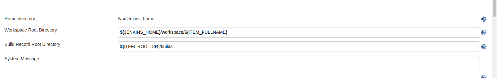

### Global Properties

Definición de las variables de entorno de jenkins.

* **SERVER_IP**

Ip del servidor en el que está alojado el sistema de integración continua. Será usado en el Jenkinsfile para conectarse por ssh. Ejemplo:

```
127.0.0.1
```


* **USERNAME**

User con el que jenkins se conectará al servidor en el que está alojado el sistema de integración continua. Será usado en el Jenkinsfile para conectarse por ssh. Ejemplo:

```
root
```

* **BASE_PATH**

Ruta al directorio en el que se encuentra el workspace de jenkins en el servidor. Ejemplo:

```
/root/ci_co/volumes/jenkins_data/workspace/
```

* **CI_CO_PATH**

Ruta al directorio donde se encuentra alojado el sistema de integración continua, a la altura en la que se encuentra del docker-compose.yml del sistema. Ejemplo:

```
/root/ci_co
```

* **SCRIPTS_BASE_PATH**

Ruta al directorio en el que se encuentran los scripts que van a ser usados desde Jenkins para distintas finalidades como limpiar los containers dockers parados. Ejemplo: 

```
/root/scripts
```

* **MAVEN_SCRIPTS_BASE_PATH**

Ruta al directorio en el que se encuentran los scripts que van a ser usados desde Jenkins para ejecutar las distintas fases de Maven. Ejemplo: 

```
/root/scripts/maven_scripts
```

* **APPLICATION_PRE_FILETOCONTAINER_PATH**

Ruta al directorio en el que se encuentrarán los archivos que van a ser desplegados en el servidor de aplicaciones para su versión de Pre-Producción (por ejemplo, Wildfly) haciendo uso de docker. Esta ruta le indicará a Jenkins dónde enviar los artefactos resultantes de la compilación para su posterior despligue. Ejemplo: 

```
/ci_co/application_pre/files_to_container/
```

* **APPLICATION_PRO_FILETOCONTAINER_PATH**

Ruta al directorio en el que se encuentrarán los archivos que van a ser desplegados en el servidor de aplicaciones para su versión de Producción (por ejemplo, Wildfly) haciendo uso de docker. Esta ruta le indicará a Jenkins dónde enviar los artefactos resultantes de la compilación para su posterior despligue. Ejemplo: 

```
/ci_co/application_pro/files_to_container/
```
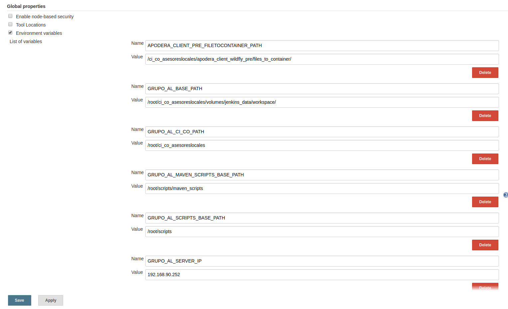

### SonarQube servers

A continuación se especifica las propiedades a tener cuenta en el apartado [SonarQube installations]

* Name

Nombre del servidor de Sonar. Este valor debe coincidir con el nombre que se le da en el Jenkinsfile a withSonarQubeEnv(). Ejemplo:

```
Name: SONAR
```

```
 stage('SonarQube analysis') {
             steps {
                script {
                  scannerHome = tool 'SONARQUBE-SCANNER'
                }
                withSonarQubeEnv('SONAR') {
                  sh "${scannerHome}/bin/sonar-scanner"
                }
             }
        }
```

* Server URL: 

Dirección en la que se encuentra el sonar. Ejemplo: 

```
Server URL: http://sonar:9000
```
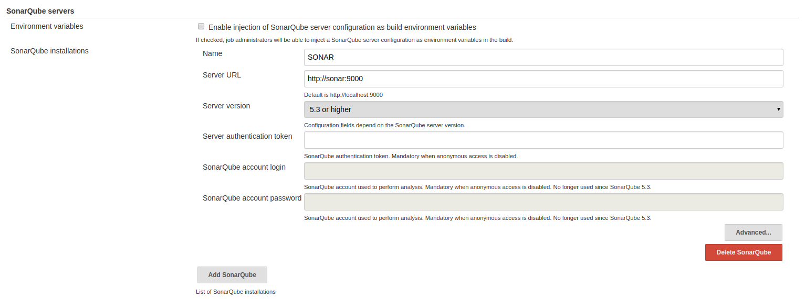

### Jenkins Location

Dirección URL en el cuál se encuentra alojado Jenkins (Dirección IP y puertos correspondientes). Ejemplo: 

```
http://127.0.0.1:8080/
```

### Publish over SSH

* **SSH Servers**

En este apartado se agregan todos los servidores a los que se necesita conectarse por ssh. Habrá un servidor configurado por cada aplicación dada de alta en el sistema de integración continua, así como el propio servidor dado de alta para permitir la conexión al mismo por ssh. A continuación la ejemplificación del servidor local y del servidor de una aplicación (versiones de Pre-Producción y Producción). 

Para cada servidor se ha de dar como información su nombre que luego se usará como variable de entorno, hostname (dirección IP dónde está alojado), username (nombre de usuario para conectarse al host) y path to key. Este último si las credenciales se dan a partir de una clave pública autogenerada en el servidor deberá indicar donde se encuentra la misma. 

* SERVIDOR LOCAL

```
Name: CI_CO_SERVER
Hostname: 127.0.0.1
Username: root 
Path to key: /root/.ssh/id_rsa
Port: 22
Timeout(ms): 300000
```

* SERVIDOR DE PRE-PRODUCCIÓN APLICACIÓN

```
Name: APLICATION_PRE_SERVER
Hostname: 127.0.0.1
Username: root 
Path to key: /root/.ssh/id_rsa
Port: 22
Timeout(ms): 300000
```

* SERVIDOR DE PRO-PRODUCCIÓN APLICACIÓN

```
Name: APLICATION_PRO_SERVER
Hostname: 127.0.0.1
Username: root 
Path to key: /root/.ssh/id_rsa
Port: 22
Timeout(ms): 300000
```
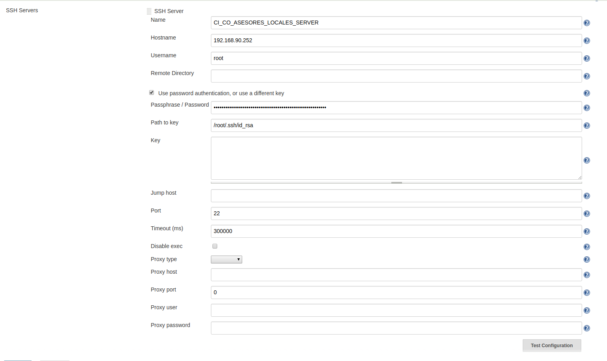

## Configure Credentials

* **Providers**

En esta opción marcar Only selected y seleccionar los siguientes: 

- Jenkins Credentials Provider
- User Credentials Provider	

* **Types** 

Marcar la opción Only selected y seleccionar los siguientes: 

- SSH Username with private key 
- Username with password

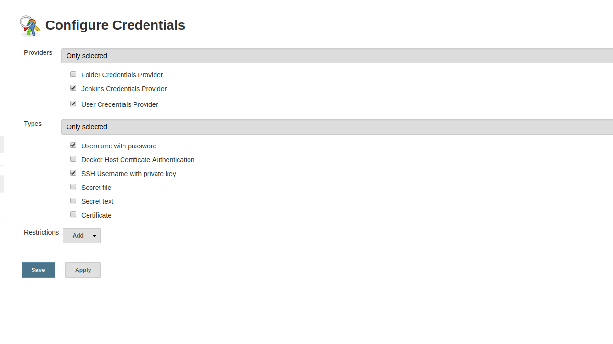

## Credentials

Definición de las credenciales de Jenkins, se pueden configurar haciendo uso de un usuario/contraseña con permisos de administración o a partir de una clave pública generada en el servidor. 

```
IMPORTANTE: La clave generada en el servidor debe ser inyectada en el contenedor de Jenkins durante la construcción del mismo (mirar Dockerfile de Jenkins). De esta forma, el servidor y el contenedor de Jenkins compartirán la misma clave pública, permitiendo a Jenkins acceso no restringido al servidor). 
```

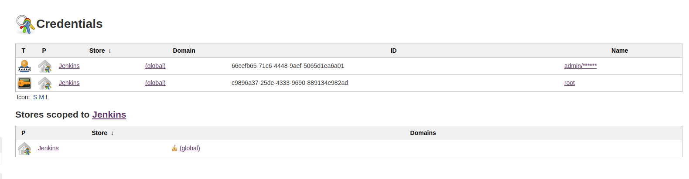

* Username with Credentials 

```
Scope: Global(Jenkins, nodes, items, all child items, etc)
Username: admin
Password: adminPassword
```
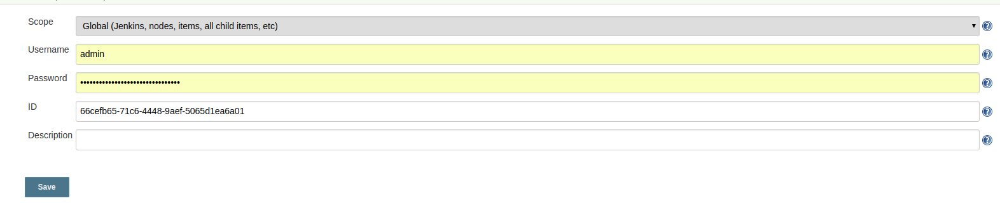

* SSH Username with private key

```
Scope: Global(Jenkins, nodes, items, all child items, etc)
Username: root
Private key: From the Jenkins master ~/.ssh
```
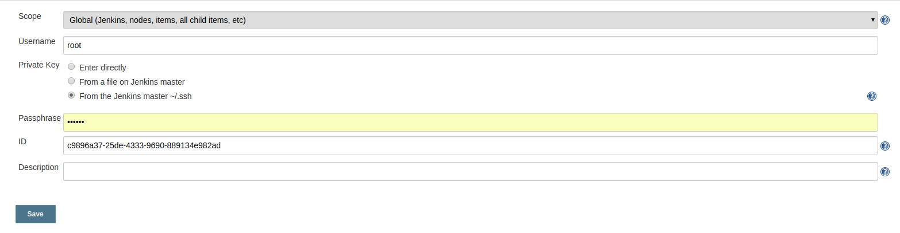

## Global Tool Configuration 

### SonarQube Scanner

Para instalar un nuevo SonarQube Scanner se hará pulsando sobre el botón *SonarQube Scanner Installations* para proceder a la configuración del mismo. 

* SonarQube Scanner

Se debe proporcionar información como su nombre y la forma de instalación del mismo. En este caso, se procederá la instalación a partir del repositorio de Maven Central de forma automática. 

**IMPORTANTE: El nombre asignado al scanner de SonarQube debe coincidir con el *ScannerHome* del Jenkinsfile.**

Ejemplo en la configuración aplicada a Jenkins y su posterior uso en un Jenkinsfile:  

```
Name: SONARQUBE-SCANNER
```

```
 stage('SonarQube analysis') {
             steps {
                script {
                  scannerHome = tool 'SONARQUBE-SCANNER'
                }
                withSonarQubeEnv('SONAR') {
                  sh "${scannerHome}/bin/sonar-scanner"
                }
             }
        }
```

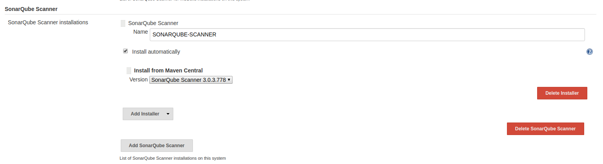

## New Item

La mayor parte de la configuración de un proyecto queda relegada al **Jenkinsfile** (en caso de tratarse de un proyecto de este tipo), sin embargo, dar de alta de un proyecto debe hacerse a través de la interfaz de usuario como se va a detallar a continuación. 

**Nota:** A partir de la creación de los primeros proyectos la creación de los siguientes puede realizarse a partir de la opción *Copy from* y la selección de un job (indicado por su nombre) ya existente que comparte la configuración con el que se quiere dar de alta. 

### **Multibranch Pipeline**

* **Branch Sources** 

Se ha de añadir un branch source usando la opción *Add source** y escogiendo la opción de Git.

A continuación se usarán una serie de parámetros comunes para cualquier tipo de proyecto (parent, compile, standard-module, etc) como son: 

-  URL Repository. Enlace en el que se encuentra el repositorio del proyecto. Hay que tener en cuenta que en caso de querer realizar la conexión a la plataforma en la que está alojado (Github, GitLab, Bitbucket, etc) partir de la clave ssh se ha de indicar la dirección al repositorio en dicho formato. 

- Credenciales. Deben ser dados de alta en el grupo o proyecto en el que se encuentre el repositorio para poder dar acceso a Jenkins al mismo para clonar los proyectos. En caso de realizarse por ssh se dará de alta la clave pública de Jenkins en el repositorio (debe ser la misma que se dió de alta en el área de Credentials). 

- Repository browser: Modo de identificar a qué plataforma nos estamos conectando (Github, GitLab, Bitbucket, etc). Fijar a modo automático es lo más práctico y sencillo. 

- Behaviors. Se seleccionará en primer lugar (si no está seleccionada ya por defecto) la opción *Discover branches* y en segundo lugar la opción *Filter by name (with wildcards)*. 

A partir de esta última se configurará que ramas se quiere que Jenkins tenga en cuenta y siga durante la integración continua del proyecto. En caso de un proyecto destinado a Pre-Producción se incluirán todas las ramas (usando la notación * para ello) y se excluirá la rama master. En el caso de un proyecto destinado a Producción se incluirá la rama master y se excluirán el resto de ramas (usando la notaciión *). 

A continuación se muestra un ejemplo de dicha configuración: 

```
Git: git@gitlab.example.com:group-name/project-application-name.git
Credentials: SSH-RSA
Repository browser: Auto
Behavior: 
  - Discover branches
  - Filter by name (with wildcards): 
      - Include: ramas-a-incluir
      - Exclude: ramas-a-excluir
```

* **Build Configuration** 

Definir la configuración de build a partir del Jenkinsfile usando el modo de este y definiendo el path en el que se encontrará dicho fichero. Si el fichero se encuentra en el directorio raíz del proyecto sólo se ha indicar el nombre del Jenkinsfile en el mismo. 


```
Mode by Jenkinsfile 
Script path Jenkinsfile
```

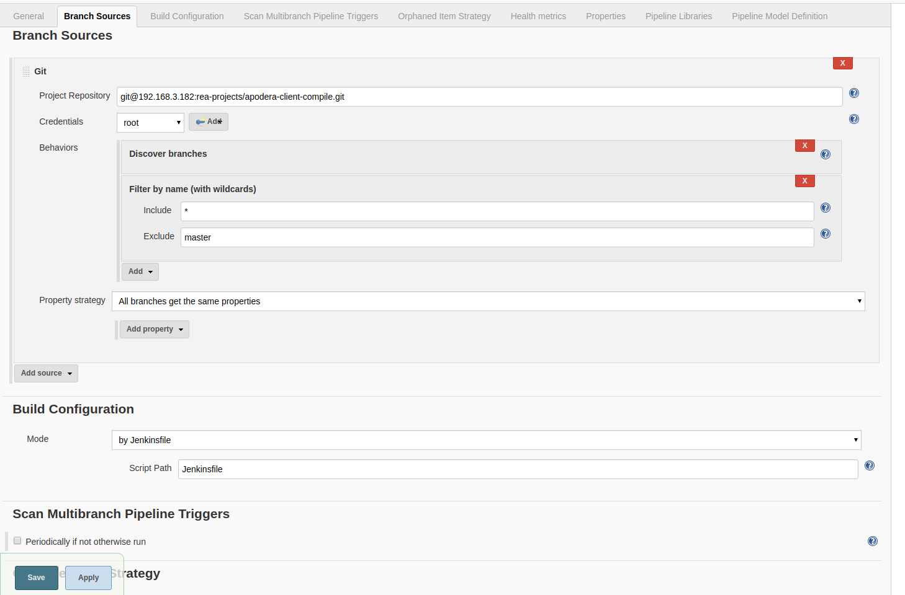

El resto de configuración del proyecto se realizarás a partir del Jenkinsfile. 

**Nota:** en la carpeta templates se encuentra plantillas de Jenkinsfiles genéricos para proyectos parent y compile.


### **Job Add Known Hosts**

Dar de alta un nuevo job de tipo Project. La finalidad de este job será la de agregar la clave de Jenkins (que a su vez es la misma que la del servidor) a la lista de claves conocidas por el host (archivo en la carpeta .ssh/known_hosts) 

* **Execute shell**

El único paso de configuración de Jenkins que se realizará será la ejecución del siguiente comando a través de la consola: 

```
ssh-keyscan -H ${SERVER_IP} >> ~/.ssh/known_hosts 
``` 

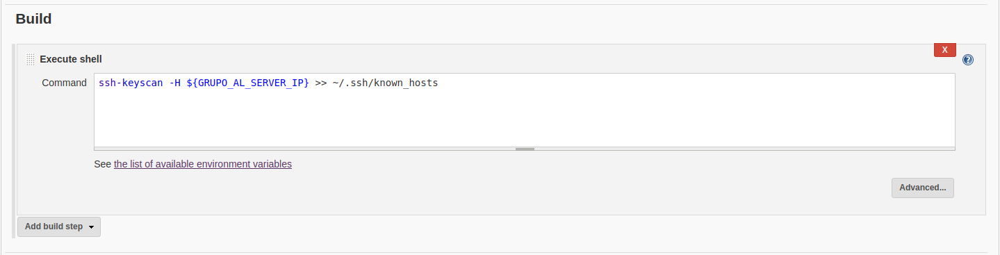

**Nota: la variable de entorno $SERVER_IP debe de haber sido previamente configurada en Jenkins (mirar apartado sobre las variables de entorno).**

Este job deberá ser ejecutado una única vez en Jenkins en su configuración inicial para poder permitir el acceso de este por ssh al servidor. Acceso necesario para poder borrar y crear directorios y la transferencia de archivos (ver documentación de Pipeline).